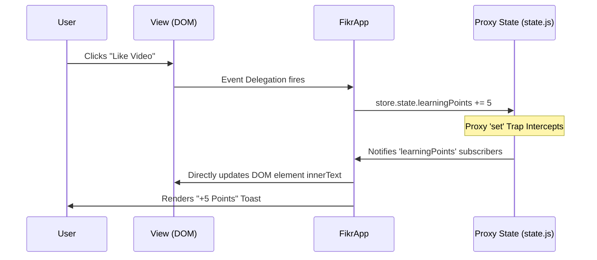

# Fikr System Architecture & Technical Documentation

> **Learn. Create. Share.** 
> Fikr is a pioneering educational social network designed specifically for children aged 8-16, transforming them from passive digital consumers into active creators through a gamified, neuro-inclusive, and secure platform.

> **🆕 Brand Mark** — The legacy 💡 emoji has been replaced with the
> proper brand symbol from the Charte graphique (slide 4): a rounded
> square with a violet→ambre diagonal gradient, an inset dark "window"
> and an ambre signal-dot. Implemented as inline SVG in the landing
> nav, landing footer, and app sidebar; also serves as the favicon
> (`logo.svg`) with built-in `prefers-color-scheme` support.

> **🆕 Curriculum Path** — A reusable, drill-down learning path
> (Year → Course → Lesson) ships with 6 years × 9 subjects × 10
> items per course (≈540 lessons) and a content modal that supports
> six rich item types (scenario · topic · exercise · quiz · video ·
> project). See §3.5 and §8.

---

## 📑 Table of Contents

1. [Executive Summary & Philosophy](#1-executive-summary--philosophy)
2. [Technology Stack & Directory Structure](#2-technology-stack--directory-structure)
3. [Core Architectural Modules](#3-core-architectural-modules)
   - [3.1 Reactive State Engine (`state.js`)](#31-reactive-state-engine-statejs)
   - [3.2 View Orchestrator (`app.js`)](#32-view-orchestrator-appjs)
   - [3.3 Learning Feed Engine (`video-engine.js`)](#33-learning-feed-engine-video-enginejs)
   - [3.4 Safety & Authentication Layer (`safety.js`)](#34-safety--authentication-layer-safetyjs)
   - [3.5 Curriculum Path Engine (`curriculum.js` + `curriculum-data.js`)](#35-curriculum-path-engine)
4. [Application Views & Layouts](#4-application-views--layouts)
5. [Data Flow Lifecycle](#5-data-flow-lifecycle)
6. [Design System & Theming](#6-design-system--theming)
7. [Security & Accessibility](#7-security--accessibility)
8. [Curriculum Module — Reusability Guide](#8-curriculum-module--reusability-guide)

---

## 1. Executive Summary & Philosophy

The guiding philosophy behind the Fikr Web Client is **high-fidelity maximum performance with zero external dependencies**. 

Instead of relying on heavy frontend frameworks like React, Vue, or Angular, Fikr is built entirely on native **Vanilla HTML5, CSS3, and ES6+ JavaScript**. This architecture ensures absolute control over the DOM, lighting-fast parsing times, and immediate execution, which is crucial for the heavy scroll animations and video elements inherent in a modern feed-driven application.

### Key Architectural Mandates:
*   **Zero Dependencies:** No React, no Tailwind, no NPM bloat. Native Web APIs only.
*   **Proxy-based Reactivity:** centralized state management utilizing the native ES6 `Proxy` API.
*   **Intersection-Driven Rendering:** Utilizing `IntersectionObserver` heavily for view culling, lazy loading, and scroll-reveals.
*   **Bento-Grid Glassmorphism:** A cohesive, ultra-modern UI relying on CSS Custom Properties (Variables) for seamless theming (Light/Dark mode).

---

## 2. Technology Stack & Directory Structure

*   **HTML**: Semantic HTML5 layout mechanisms.
*   **CSS**: Native CSS Grid/Flexbox, heavy use of CSS Custom Properties for scope and theming.
*   **JavaScript**: ES6 Modules, strict vanilla classes, and native Web APIs (`DOMParser`, `Proxy`, `IntersectionObserver`, `localStorage`).

### File Mapping

```text
/
├── index.html                  # Marketing landing page
├── app.html                    # Main Single Page Application (SPA) shell
├── logo.svg                    # Brand mark — favicon w/ prefers-color-scheme
├── css/
│   ├── main.css                # Global design tokens, resets, layouts, themes
│   ├── landing.css             # Unique styles for index.html scroll-reveals
│   └── components/             # Component-scoped stylings
│       ├── sidebar.css
│       ├── card.css            # Bento grid cards
│       ├── feed.css            # Tiktok-style scrolling feed
│       ├── modal.css           # Parental gate
│       ├── clubs.css           # Club grids
│       ├── profile.css
│       └── settings.css
└── js/
    ├── landing.js              # IntersectionObservers and scroll animations
    ├── app.js                  # Main Application Orchestrator class
    └── modules/
        ├── state.js            # Single Source of Truth store
        ├── video-engine.js     # Vertical scroll feed logic
        ├── safety.js           # Math parental gate & HTML Sanitization
        ├── curriculum.js       # Year → Course → Lesson view engine + content modal
        └── curriculum-data.js  # Mock dataset (years, subjects, courses, items)
```

---

## 3. Core Architectural Modules

The application logic is decoupled into distinct ES6 modules to separate data handling from DOM manipulation.

### 3.1 Reactive State Engine (`state.js`)

> [!NOTE]
> **Design Decision:** Instead of the publish-subscribe pattern of Redux or the Virtual DOM diffing of React, Fikr utilizes native ES6 Proxies for surgical DOM updates.

The `createStore` function wraps a plain JavaScript object in a `Proxy`.
*   **The Interception:** When a property is mutated (`set` trap), the proxy automatically alerts a `Map` of registered listeners.
*   **The Hydration:** When a component subscribes to a property (e.g., `learningPoints`), the callback fires immediately to hydrate the UI, and then fires on every subsequent mutation.
*   **Error Boundaries:** Try-catch blocks wrap subscriber executions to ensure one broken UI component doesn't crash the entire state pipeline.

### 3.2 View Orchestrator (`app.js`)

The Fikr SPA is managed by the `FikrApp` class. It acts as the central hub:
1.  **Lazy Initialization:** Views (like the Profile or Settings) are not rendered to the DOM until the user navigates to them for the first time.
2.  **State Binding:** During `init()`, `app.js` runs `this.store.subscribe(...)` to link the raw DOM nodes to the Proxy state. 
3.  **Persistence:** Changes to user preferences (Theme, Animations, Username) are aggregated and saved to `localStorage`, allowing state to survive page refreshes.

### 3.3 Learning Feed Engine (`video-engine.js`)

The highest-complexity view is the vertical scrolling video feed, mimicking modern apps like TikTok/Reels.

> [!TIP]
> **Performance Optimization:** Because 100+ videos loaded in the DOM would exhaust memory on low-end devices, the engine utilizes the `IntersectionObserver` API at a `0.7` threshold. Only videos currently 70% visible in the viewport receive the `.stream__item--active` class, pausing off-screen media and culling background calculations.

*   **Delegation:** Engagement buttons (Like, Share, Remix, Comment) use **Event Delegation** attached to the parent container. This prevents attaching hundreds of individual event listeners.

### 3.4 Safety & Authentication Layer (`safety.js`)

Because Fikr targets children (8-16), two strict safety protocols are instituted:
*   **Parental Gate Promise:** Gated areas (like Settings) invoke a `Promise`-based modal. It generates a randomized, age-restrictive math problem (`generateMathProblem()`). The UI awaits the Promise resolution before executing the view swap.
*   **DomParser Sanitizer:** All user-generated text (like mock comments) is passed through `sanitizeContent(untrustedHTML)`. This spins up an inert, headless `DOMParser` document to strip out executable `<script>` or inline `onerror` tags, neutralizing XSS vector attacks.

### 3.5 Curriculum Path Engine

> [!NOTE]
> **Design Decision:** The curriculum is a **two-file, self-contained module** so the entire learning path (data + logic + content modal) can be lifted into another vanilla project with a single import.

*   **`curriculum-data.js`** — Pure data: 6 `YEARS`, 9 `SUBJECTS`, 54 `COURSES` (Cartesian product), ~540 `ITEMS` generated from a compact rotation of types/difficulty/duration plus a chapter-title pool keyed by (subject × year). Replace any constant to plug in real content; downstream rendering reads only the documented JSDoc shapes.
*   **`curriculum.js`** — `initCurriculum(opts)` factory. Owns three drill-down views (Years grid, Courses grid, Course Detail) and a content modal that dispatches on `item.type` to render six different bodies (scenario comic panels, topic explainer, exercise/quiz with answer-checking, video placeholder, project checklist).
*   **Sequential Unlock:** `resolveStatus()` keeps lessons gated — the first 3 of each course are always available, the rest unlock when the previous one is completed. This rewards consistent progression without blocking exploration.
*   **Reactive Bridge:** Completion state (`completedItemIds`) and mastery (`masteredCourseIds`) are owned by the host's reactive store (`state.js`). The module emits `onCompletedChange` and `onMasterCourse` callbacks, so the host persists to `localStorage` and re-renders dependent UI (e.g., the Bento "Lessons Done" tile) without curriculum.js touching anything outside its containers.

---

## 4. Application Views & Layouts

*   **Dashboard (`app.js & card.css`)**: The hub. Uses CSS Grid (`grid-template-columns: repeat(4, 1fr)`) to create the varying-spans "Bento Box" layout. Displays streak, points, preview widgets.
*   **Learning Stream (`video-engine.js`)**: CSS Scroll Snap (`scroll-snap-type: y mandatory`). Each video snaps firmly to the viewport boundaries.
*   **Creative Clubs:** Filterable grid layout where users can join clubs. Changes reactively update `learningPoints`.
*   **Profile (`profile.css`)**: Collects state from the Proxy. Displays dynamic arrays like earned Badges, "My Creations", and "Joined Clubs". 
*   **Settings (`settings.css`)**: Controls persistence. Includes Avatar Pickers, Name Inputs (Debounced to prevent excessive state mutations), and hardware toggle switches (Dark Mode, Animations). A **Reset to Defaults** button restores prefs without wiping progress (joined clubs, completed lessons).
*   **Curriculum (`curriculum.css`)**: Three nested views with a shared breadcrumb component. Year cards expose a `--card-color` custom property so each year gets a unique accent without rule overrides. The Course Detail view shows a banner with an SVG progress ring (`stroke-dasharray` driven by completion %), search + type pills + difficulty/status dropdowns, and a vertical item list with type badges and lock/check icons.

---

## 5. Data Flow Lifecycle

The following diagram illustrates how user engagement updates the system synchronously without a Virtual DOM.



---

## 6. Design System & Theming

The UI employs a premium "Glassmorphism" aesthetic.

*   **Variables First:** All colors, shadows, and layout constants are stored in `:root` in `main.css`.
*   **Light/Dark Mode Interchange:** By simply appending `[data-theme="light"]` to the `<html>` root, the CSS specifically overrides the variables mapping background colors from deep blacks/purples to slate whites/grays. The rest of the CSS components dynamically absorb these new tokens.
*   **Gradients & Depth:** Cards utilize linear gradients with transparency (`rgba(255,255,255, 0.1)`) accompanied by `backdrop-filter: blur(12px)` to achieve the frosted glass effect, layering elements in Z-space.
*   **Brand Mark (Logo):** Defined per the Charte graphique (slide 4) and shipped as both a static `logo.svg` (used as the favicon, with embedded `prefers-color-scheme` to invert the inner window) and inline `<svg class="fikr-logo">` blocks in the landing nav / footer / app sidebar. The inner "window" rectangle uses `fill: var(--color-bg-deep)` so it themes automatically — dark slate in dark mode, light slate in light mode — without any JS. Each instance carries a unique `<linearGradient id>` (`fikr-grad-nav`, `fikr-grad-foot`, `fikr-grad-side`) so multiple logos can coexist on a single page without ID collisions.

---

## 7. Security & Accessibility

> [!CAUTION]
> **Accessibility Standard:** An application targeting minors must account for varying neurological profiles and hardware constraints.

*   **`no-animations` Utility:** For users with vestibular motion sensitivity (or old devices), the Settings pane includes an "Animations" toggle. Turning it off injects a global `.no-animations` class into the DOM body that forcefully overrides (`!important`) all CSS `animation-duration` and `transition-duration` to `0s`.
*   **Sanitization:** Strict XSS prevention in `safety.js`.
*   **Neuro-inclusive Palettes:** Contrast ratios are deliberately tested against WCAG 2.1 AA standards; gradients are vibrant but avoid strobing.

---

## 8. Curriculum Module — Reusability Guide

The curriculum path is intentionally engineered as a **portable subsystem**. Drop `js/modules/curriculum.js`, `js/modules/curriculum-data.js`, and `css/components/curriculum.css` into any vanilla web project to get a complete Year → Course → Lesson UI.

### 8.1 Public API

```js
import { initCurriculum } from './modules/curriculum.js';

const curriculum = initCurriculum({
  // Required containers
  yearsContainer:   document.getElementById('view-years'),
  coursesContainer: document.getElementById('view-courses'),
  detailContainer:  document.getElementById('view-course-detail'),
  modalOverlay:     document.getElementById('curriculum-modal'),

  // Required: host's view-router (id => void)
  switchView: (id) => myRouter.show(id),

  // Optional: persistence + gamification hooks
  completedIds:      ['math-y3-1', ...],
  onCompletedChange: (ids) => localStorage.setItem('done', JSON.stringify(ids)),
  onEarnPoints:      (amount, item) => store.points += amount,
  onShowToast:       (type, title, msg) => toast.show(type, title, msg),
  onMasterCourse:    (course) => unlockBadge(course.masterBadge),
});

curriculum.showYears();              // Programmatic navigation
curriculum.showCourses('y5');
curriculum.showCourseDetail('math-y5');
curriculum.openItem('math-y5-3');
curriculum.getCompletedIds();        // string[]
curriculum.hydrateCompletion(ids);   // Bulk-set completion (e.g. on settings reset)
```

### 8.2 Replacing the Dataset

Edit `curriculum-data.js`. The shape is documented at the top of the file:

```js
// Replace YEARS, SUBJECTS, or CHAPTER_POOLS — that's it.
// COURSES and ITEMS are derived automatically; their JSDoc Type
// definitions show the exact field set the rendering code reads.
export const YEARS    = [/* Year[] */];
export const SUBJECTS = [/* Subject[] */];
const CHAPTER_POOLS   = { math: { y1: [...], ... }, ... };
```

The six content factories (`buildScenario`, `buildTopic`, `buildExercise`, `buildQuiz`, `buildVideo`, `buildProject`) live in the same file — swap their bodies to inject your real content.

### 8.3 Content-Type Schema

Every rich modal payload follows a small, documented contract:

| Type     | Payload Shape                                                            |
|----------|--------------------------------------------------------------------------|
| scenario | `{ panels: [{ bg:[c1,c2], emoji, narration, caption }, ...] }`           |
| topic    | `{ sections: [{ heading, body }, ...] }`                                 |
| exercise | `{ intro, questions: [{ q, answer }] }` (case-insensitive answer match)  |
| quiz     | `{ intro, questions: [{ q, options:[…], answer:<index> }] }`             |
| video    | `{ duration, description, bg:[c1,c2] }`                                  |
| project  | `{ brief, steps: [str, ...] }`                                           |

Adding a new type means: extend `ITEM_TYPES`, add a `build*` factory, register a renderer in `renderTypeBody()` inside `curriculum.js`.

### 8.4 Sequential Unlock Logic

`resolveStatus(item, courseItems, completedSet)` returns one of:

* `completed` — id is in the set
* `available` — among the first 3 items, OR the previous item is complete
* `locked`    — otherwise

To make every item available immediately (e.g., for a sandbox), short-circuit the function to always return `'available'`.

### 8.5 Persistence Footprint

The module is **stateless across reloads** — the host owns durable state. Two arrays are all that's required: `completedItemIds` (string[]) and `masteredCourseIds` (string[]). Both live in `fikr_settings` (localStorage) for this app; replace with any backend.

---

## 9. Scalability & Future Roadmap

Since the frontend logic is definitively decoupled, expanding Fikr involves plugging backend services into the existing architecture.

1.  **Backend Integration:** The `Proxy` store's `set` trap can easily be appended to push asynchronous payloads to Firebase Firestore / Supabase on every mutation, transforming the mock state into a legitimate Real-Time synced application.
2.  **Authentication:** Integrating Google Auth / Firebase Auth logic immediately overriding the `FikrApp.init()` boot sequence.
3.  **Media Upload:** Establishing S3 bucket streams so children's webcams can record "Remixes" and push BLOBs directly to the `video-engine.js` array.
4.  **Curriculum LMS Sync:** Replace `curriculum-data.js` with a fetch from a real LMS API (e.g., Moodle, Canvas) — `curriculum.js` only reads through `getYear / getSubject / getCourse / getItem` helpers, so the rendering layer stays untouched.
