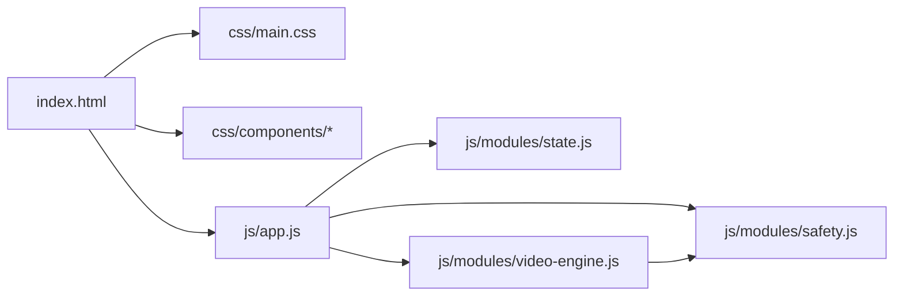

# Fikr — Educational Social Network Prototype

A high-fidelity, production-ready prototype built with **zero dependencies** — strictly Vanilla HTML5, CSS3, and ES6+ JavaScript with ES Modules.

## Architecture Overview



## File Structure

| File | Purpose |
|------|---------|
| [index.html](file:///c:/Users/mystery/Downloads/FreePoo/Fickr/index.html) | Semantic HTML5 entry point with all views |
| [app.html](file:///c:/Users/mystery/Downloads/FreePoo/Fickr/app.html) | Single-Page Application shell (8 views) |
| [logo.svg](file:///c:/Users/mystery/Downloads/FreePoo/Fickr/logo.svg) | Brand mark — favicon with `prefers-color-scheme` support |
| [css/main.css](file:///c:/Users/mystery/Downloads/FreePoo/Fickr/css/main.css) | Design tokens, reset, layout, buttons, animations |
| [css/components/sidebar.css](file:///c:/Users/mystery/Downloads/FreePoo/Fickr/css/components/sidebar.css) | Fixed sidebar navigation |
| [css/components/card.css](file:///c:/Users/mystery/Downloads/FreePoo/Fickr/css/components/card.css) | Bento Grid cards + Creative Clubs view + clubs search |
| [css/components/feed.css](file:///c:/Users/mystery/Downloads/FreePoo/Fickr/css/components/feed.css) | Scroll-snap video feed |
| [css/components/modal.css](file:///c:/Users/mystery/Downloads/FreePoo/Fickr/css/components/modal.css) | Parental Gate modal |
| [css/components/profile.css](file:///c:/Users/mystery/Downloads/FreePoo/Fickr/css/components/profile.css) | Profile banner / stats / badges / creations |
| [css/components/settings.css](file:///c:/Users/mystery/Downloads/FreePoo/Fickr/css/components/settings.css) | Settings cards / toggles / avatar picker |
| [css/components/curriculum.css](file:///c:/Users/mystery/Downloads/FreePoo/Fickr/css/components/curriculum.css) | Years grid / Course cards / Item list / Content modal |
| [js/app.js](file:///c:/Users/mystery/Downloads/FreePoo/Fickr/js/app.js) | Main orchestrator (FikrApp class) |
| [js/modules/state.js](file:///c:/Users/mystery/Downloads/FreePoo/Fickr/js/modules/state.js) | Proxy-based reactive store |
| [js/modules/video-engine.js](file:///c:/Users/mystery/Downloads/FreePoo/Fickr/js/modules/video-engine.js) | IntersectionObserver video engine |
| [js/modules/safety.js](file:///c:/Users/mystery/Downloads/FreePoo/Fickr/js/modules/safety.js) | Parental Gate + ContentSanitizer |
| [js/modules/curriculum.js](file:///c:/Users/mystery/Downloads/FreePoo/Fickr/js/modules/curriculum.js) | Year → Course → Lesson view engine + content modal |
| [js/modules/curriculum-data.js](file:///c:/Users/mystery/Downloads/FreePoo/Fickr/js/modules/curriculum-data.js) | Mock dataset (6 years × 9 subjects × 10 items ≈ 540) |

## Features Implemented

### 1. Bento Grid Dashboard
The default view uses `CSS Grid` with varying column/row spans for a playful, modern layout with glassmorphism cards. Includes Welcome, Profile, Learning Points, Streak, Stats, Stream Preview, Clubs Preview, and Achievements widgets.

### 2. Learning Stream (Video Feed)
- **CSS `scroll-snap-type: y mandatory`** for TikTok-style vertical snapping
- **`IntersectionObserver`** auto-activates videos at 70% viewport threshold
- Animated gradient backgrounds with floating shapes simulate video content
- **"Remix This"** button captures video metadata (id, title, creator, category, duration, timestamp)
- Slide-up **comments panel** with HTML-sanitized content

### 3. Creative Club Hub
- 12 clubs rendered dynamically from a JS data object
- **7 category filter pills** (All, Coding, Art, Science, Theater, Music, Reading)
- Filter system toggles clubs via JS without page refresh
- Join button awards +50 Learning Points reactively

### 4. Safety Layer & Parental Gate
- **Math challenge modal** with randomized multiplication/addition problems
- Promise-based API — `await gate.open()` returns `true/false`
- Auto-regenerates new problem after wrong answer
- **`sanitizeContent()`** uses `DOMParser` to strip all HTML tags from user comments

### 5. Reactive State Management (Proxy API)
- `createStore()` wraps state in a `Proxy` that intercepts `set` operations
- `subscribe(property, callback)` for property-level reactive binding
- Learning Points, username, level, streak, avatar, and badges all update reactively
- Points counter animates with a pop effect on change

### 6. Visual Identity — "The Creative Lab"
- **Palette**: Primary `#6D28D9`, Accent `#F59E0B`, Background `#0F172A`
- **Typography**: Lexend (neuro-inclusive)
- **Border radius**: 24px+ on cards
- **Micro-interactions**: hover scales, glow effects, waving hand, floating shapes, shimmer progress bars, bounce-in achievements, toast slide-ins

### 7. Curriculum Path 📘
- **Three drill-down views**: Years (6 cards) → Courses (9 subject cards per year) → Course Detail (10 items + filters)
- **6 item types** with rich modal content: 📖 Scenarios (4-panel comics), 📚 Topics (sectioned explainers), ✏️ Exercises (multi-step input + answer-checking), ❓ Quizzes (multiple-choice), 🎬 Videos (gradient placeholder), 🛠️ Projects (checklist briefs)
- **Triple filtering**: type pills + difficulty dropdown + status dropdown + free-text search — all composable
- **Sequential unlock**: first 3 items always available; later items unlock as you progress
- **Reactive rewards**: 20–60 points per completion (by type), course-mastery toast at 100%, dashboard "Lessons Done" stat updates live
- **Persistence**: completed item IDs and mastered course IDs survive reloads via `localStorage`
- **Two entry points**: sidebar 📘 Curriculum nav item AND a dashboard Bento tile

## Verification

All features tested in-browser:

````carousel

<!-- slide -->

<!-- slide -->

<!-- slide -->

<!-- slide -->

````


> [!NOTE]
> The app runs with zero dependencies — just open `index.html` via any local server (e.g. `npx serve .`) to serve ES Modules correctly. Currently running at `http://localhost:3000`.
